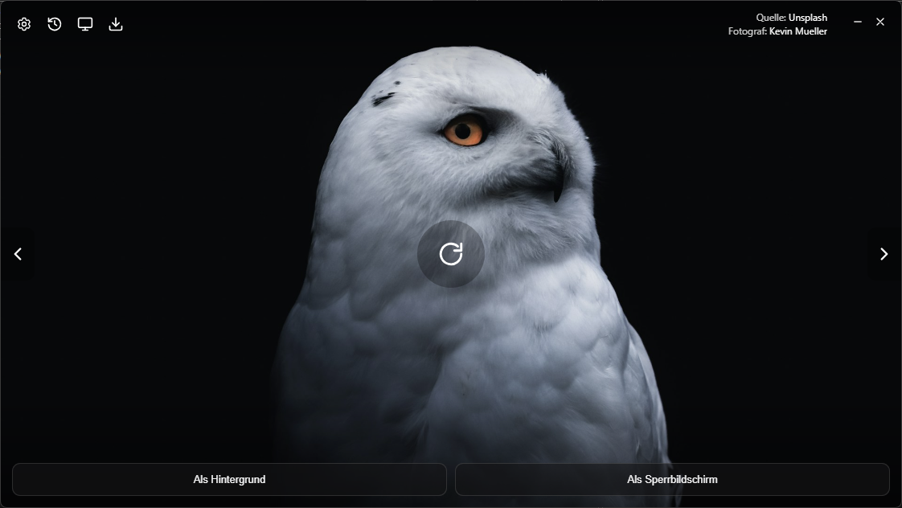

**English** · [Deutsch](README.de.md)


# Wowl

**Desktop & lock-screen wallpapers from Unsplash, Bing & more – search, browse, set.**

Modern · minimalist · lightweight · portable

***



## Download

Windows is available now — see [Releases](https://github.com/naderi/wowl/releases) for the portable `.exe` and the installer. macOS and Linux builds are planned.

## Features

- **Image sources**: Unsplash, Pixabay and Wallhaven (with search), Bing – Picture of the Day, Lorem Picsum
- **Click the image** to load the next one; **arrow keys / ← →** browse history
- **Set as wallpaper** and **set as lock screen** (Windows)
- **Flip image** (horizontal) via right-click
- **Download** via a save-as dialog (remembers the folder)
- **History** with a tile grid, multi-select and context menu; FIFO-limited, no duplicates
- **Search terms** freely definable (comma/semicolon separated, combined into one search)
- **Frameless window** with its own title bar, fixed 16:9 shape
- **Light / dark / system** theme and **English / German**, switchable at runtime
- **Portable**: settings live as `wowl.toml` next to the `.exe`

## Image sources

| Source                        | Search |          API key           | Resolution                    |
| ------------------------------ | :---: | :-------------------------: | ------------------------------ |
| **Unsplash**                   |   ✅   |     your own access key     | Monitor resolution             |
| **Pixabay**                    |   ✅   |      your own API key       | up to Full HD                  |
| **Wallhaven**                  |   ✅   | optional (higher limits)    | ≥ Full HD, up to 4K+           |
| **Bing – Picture of the Day**  |   –   |             –              | UHD (3840×2160), last 8 days   |
| **Lorem Picsum**                |   –   |             –              | Monitor resolution             |

### Why Unsplash and Pixabay need their own API key

Unsplash and Pixabay rate-limit API access per application, not per end user — a key bundled into Wowl itself would be shared by everyone who downloaded the app and would hit the request limit for all of them within minutes. Shipping a private key inside a publicly distributed app is also against their terms. Getting your own free key keeps your usage separate from everyone else's and only takes a minute:

- **Unsplash**: create a free app at [unsplash.com/developers](https://unsplash.com/developers), copy the **Access Key**, then in Wowl: Settings → source "Unsplash" → paste the key. Demo apps are limited to **50 requests/hour**; apply for "Production" access for more.
- **Pixabay**: sign in and copy your key from [pixabay.com/api/docs](https://pixabay.com/api/docs), then paste it under Settings → source "Pixabay". Limit: **100 requests/minute**.
- **Wallhaven**: works without a key. A key from [wallhaven.cc/settings/account](https://wallhaven.cc/settings/account) only raises the request limit.

## Usage

Wowl is portable – just run `Wowl.exe`. The `wowl.toml` settings file is created next to it (or in `%APPDATA%\Wowl` if the program folder is read-only). The image cache lives in `history/`.

### Keyboard shortcuts

| Key                                             | Action                                                            |
| ------------------------------------------------ | -------------------------------------------------------------------- |
| `←` / `→`                                       | previous / next image in history                                  |
| `Esc`                                            | close menu · clear selection · leave selection mode · close page  |
| `Enter` (in settings)                            | save and go back                                                  |
| `Ctrl`+`A` / `Delete` (history, selection mode)  | select all / delete                                                |

### Lock screen (Windows)

"Set as lock screen" sets the image via the `PersonalizationCSP` registry key and requires **a UAC confirmation** as well as **Windows Pro/Enterprise**. Windows then marks the lock screen setting as "managed by your organization" — use **Settings → Lock screen → "Reset to Windows default"** to undo this.

## Building from source

Requirements: [Rust](https://rustup.rs), [Node.js](https://nodejs.org), [pnpm](https://pnpm.io), and the [Tauri system dependencies](https://tauri.app/start/prerequisites/) (on Windows: WebView2, preinstalled on Windows 10/11).

```bash
pnpm install
pnpm tauri dev      # development with hot reload
pnpm tauri build    # portable Wowl.exe under src-tauri/target/release/
```

## Tech stack

- **Backend**: Rust + [Tauri 2](https://tauri.app)
- **UI**: Vanilla TypeScript + [Vite](https://vitejs.dev), no framework
- **Image processing**: [`image`](https://crates.io/crates/image) (flipping)
- **Wallpaper**: [`wallpaper`](https://crates.io/crates/wallpaper) (fill mode)

```
src/            UI (index.html, main.ts, i18n.ts, styles.css)
src-tauri/src/  config.rs · providers.rs · history.rs · lib.rs
```
